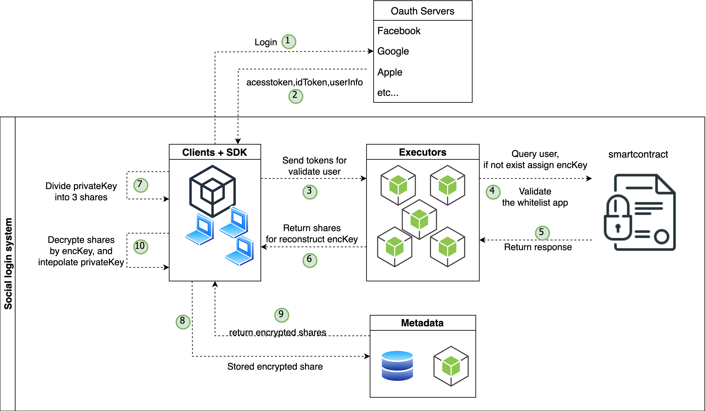
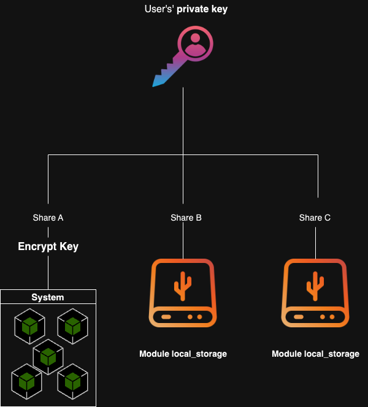
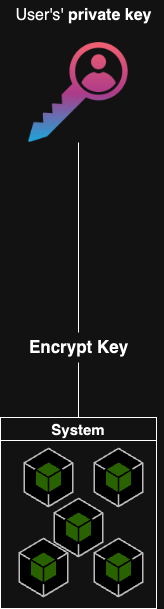

# Web3 multifactor example

A example of web3-multifactor with 2 kind of key:

- Only-social-key
- ThresholdKey

## Table of contents

1. [Overview](#overview)
2. [Specification](#specification)
   1. [ThresholdKey](#threshold-key)
   2. [Only-social-key](#only-social-key)
   3. [Explain tkey.ts](#explain-tkey.ts)
3. [How to run](#how-to-run)

<a name="overview"></a>

## Overview

There are 4 main internal components in the system:

- SDK
- Executors (5 nodes)
- Metadata (saving encrypted privateKey)
- Smart contract



<a name="specification"></a>

## Specification

<a name="threshold-key"></a>

### ThresholdKey

After being generated in client-side by SDK, the privateKey has been divided into atleast 2 shares (A, B). One share will be encrypted by the **encryptKey (encKey)** and storing in the metadata for future login. The remains have been manage by the modules such as: local-storage module, security-question modules.

<p align="center" width="100%">
    
</p>

<a name="only-social-key"></a>

### Only-social-key

The different between only-social-key and threshold key is that the user's privateKey is not divided, it is directly encrypted by **encKey** and saving to the **Metadata**.

<p name="only-social-key" align="center" width="100%">
    
</p>

<a name="explain-tkey.ts"></a>

### Explain tkey.ts

- TorusServiceProvider: Assgin, Retrieve and reconstruct the **encKey** from executor

```typescript
const customAuthArgs = {
  baseUrl: `${window.location.origin}/serviceworker`,
  network,
  blsdkg: { init, get_pk, interpolate },
};
...
const serviceProvider = new TorusServiceProvider({
  customAuthArgs,
});
```

- StorageLayer: Get, Set the encrypted share from SDK to the Metadata

```typescript
const storageLayer = new TorusStorageLayer({
  hostUrl, // the metadata endpoint
});
```

- Initialize Only-social-Key and threshold-key

```typescript
// onlySocialKey

export const OnlySocialLoginKey = new OnlySocialKey({
  serviceProvider,
  storageLayer,
});

// threshold-key
export const tKey = new ThresholdKey({
  modules: {
    webStorage: webStorageModule, //local storage module
    securityQuestions: securityQuestionsModule, // securityQuestions module
  },
  manualSync: false,
  customAuthArgs,
  storageLayer,
  serviceProvider,
});
```

<a name="how-to-run"></a>

## How to run

- Install yarn
- Default of example is using only-social-key. If you want to change to thresholdKey, you must comment only-social-key-test and uncommnet the test in index.tsx.

https://github.com/oraichain/web3-multifactor-example/blob/master/src/index.tsx?plain=1#L4-L5

- 2 enviroments are provided in example:

  - STAGING (TESTNET)
  - MAINET

```bash
yarn
yarn start:staging

```
